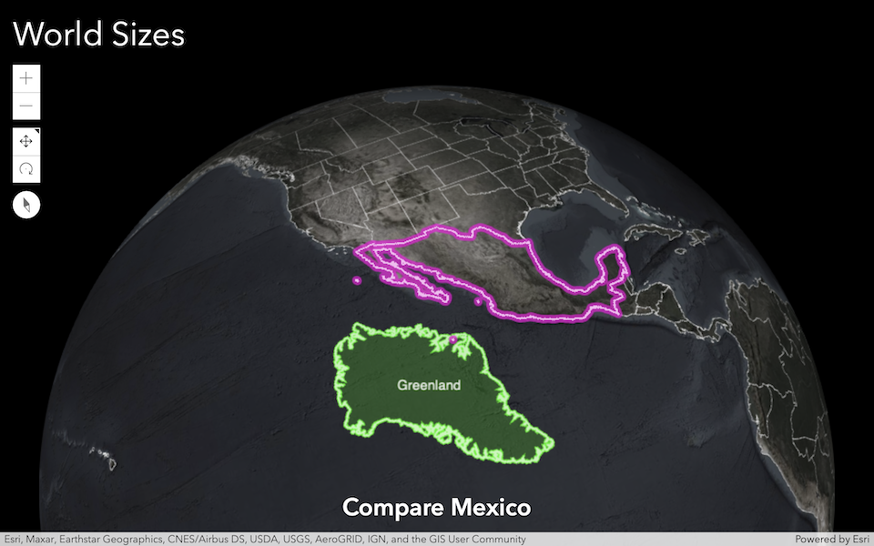

# ArcGIS API for JavaScript template

[](https://arnofiva.github.io/world-sizes)

To start:

```
node --version   # Node 20 LTS recommended
npm install
npm run dev
```

Then open your browser at the local URL printed by Vite (typically http://localhost:5173/).

To build and preview production output:

```
npm run build
npm run serve
```

## Licensing

Licensed under the Apache License, Version 2.0 (the "License");
you may not use this file except in compliance with the License.
You may obtain a copy of the License at

http://www.apache.org/licenses/LICENSE-2.0

Unless required by applicable law or agreed to in writing, software
distributed under the License is distributed on an "AS IS" BASIS,
WITHOUT WARRANTIES OR CONDITIONS OF ANY KIND, either express or implied.
See the License for the specific language governing permissions and
limitations under the License.

A copy of the license is available in the repository's [license.txt](./license.txt) file.
